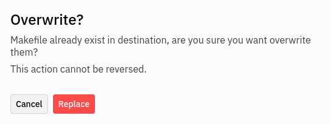

# How to install the subject

  

## `First Step`

First you need to download the repository in .zip format. Then, extract\
all the files.
  

##### *The files you will need are the files in the Petit_Bain_Subject directory*

  

## `Second Step`

Open [Replit](https://replit.com/) on your browser and put all the files in a new project.\
 
you will get this message :

 
Click on replace   

## `Let's Go`

Now have fun and do not hesitate to ask the supervisors ;)